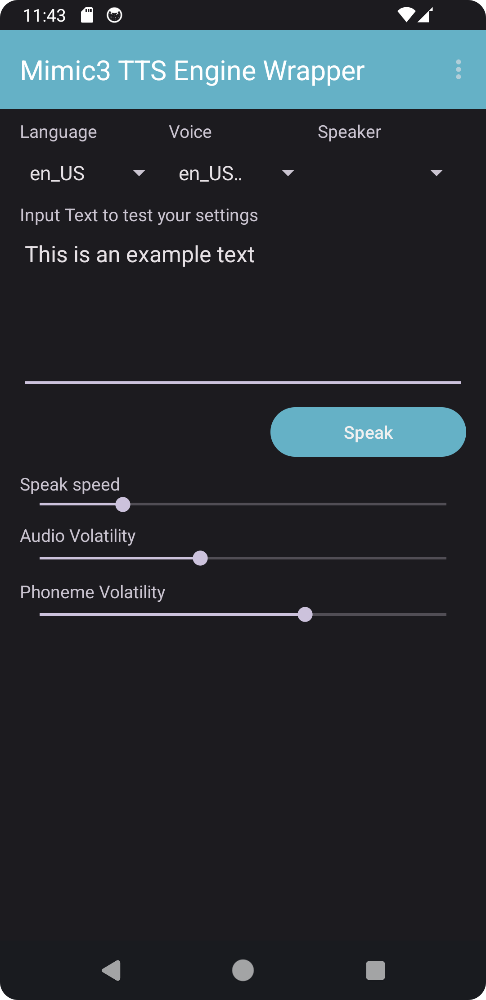
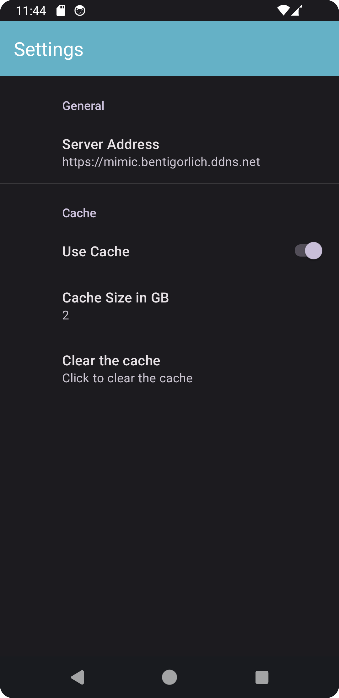

# Mimic3 TTS Service Wrapper For Android 
This app is a wrapper around the mimic3 webserver. It registers itself to android, so you can use it system wide. 
At the moment this app requires a running mimic3 server, but in the future it might be able to run locally. 
For that to work the main problem is, that the `onnxruntime` which mimic3 depends on is not supported 
by the gradle plugin `chaquopy`, which enables Android apps to use python packages. See [#216](https://github.com/chaquo/chaquopy/issues/216) in the [chaquopy](https://github.com/chaquo/chaquopy) repo

 [Mimic3](https://github.com/MycroftAI/mimic3)

Join us on matrix: https://matrix.to/#/#mimic3ttsenginewrapper-app:tchncs.de

# Quickstart

You need:
1. Android phone running Android 7 or above
2. A machine running the mimic3 webserver
3. A router which can forward ports (or an exposed webserver)

In the app you can set the server address of your server. In the future I may provide a default one. 
There is a docker image for the mimic3 webserver: `mycroftai/mimic3` [doc](https://mycroft-ai.gitbook.io/docs/mycroft-technologies/mimic-tts/mimic-3#docker-image)

NOTE: you have to run this behind a reverse proxy, because android forbids traffic to http websites by default. 
I use a docker image for that: `jc21/nginx-proxy-manager` [doc](https://github.com/NginxProxyManager/nginx-proxy-manager)

# Features

- Uses Mimic3 a open source, fast and good quality TTS engine
- Mimic3 server can run on low-end hardware like the Raspberry Pi 4
- Supports 25 languages with multiple voices and speakers, see [Mimic3 voices](https://github.com/MycroftAI/mimic3-voices) for more details
- Supports caching
- Settings for speech speed, audio volatility, phoneme volatility and cache size. An explanation of audio and phoneme volatility is available by clicking on their labels

# Screenshots
| Main Screen | Settings Screen |
| - | - |
|  |  |
